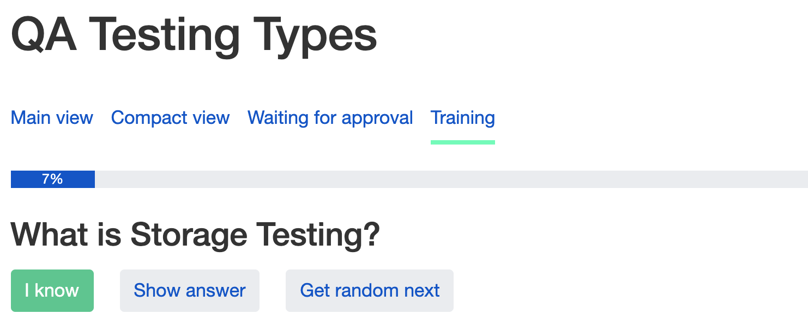

## Training

#### 1. Overview

Training allows User to assess their knowledge on particular topic using [_Cards_](homepage.md)
In order to start _Cards Training_ User should perform following steps:

* Click on [_Cards_](https://app.pasv.us/flash) hyperlink at _Progress Monitor_ header
* After being redirected to _FlashCards_ page (for logged-in users only) User can chose the topic of interest and click on it  (_Card Group_)
* User will be redirected to the page with view options which include _Training_
* Click on the hyperlink _Training_
* Click on **"Start training"**.

#### 2. Training process 

When _Training_ is in progress following elements can be seen on screen:

|       **Name**        |         **Description**        | 
|------------|-------------------|
|  Header    |   Card Group name |   
|  Progress bar  |  Shows current progress (percentage)   |  
|  Card in progress | Shows current question  |  
|  **"I Know"** button  |  Progress bar refreshes and shows progress | 
| **"Show answer"** button | Shows correct answer to current Card |
| **"Get random next"** button | Randomly switches to another Card in the Card Group |

#### 3. Training rules

* User can't start new _Training_ with the same _Card Group_ if there is a _Training_ in progress
* When _Training_ is finished successfully, **“Start training”** button appears again.

