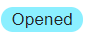
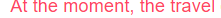
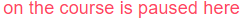
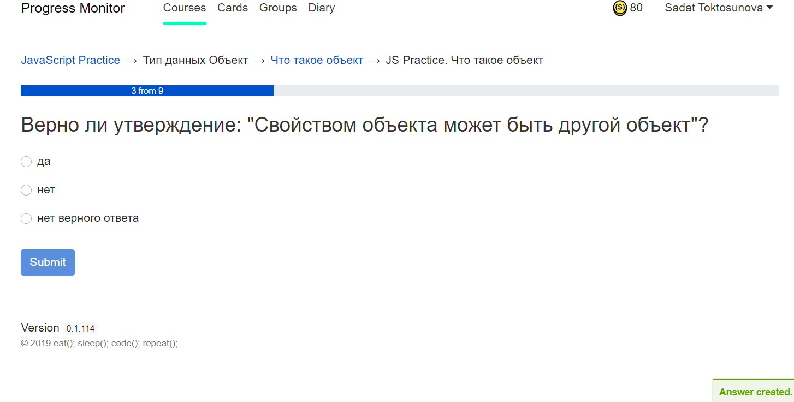
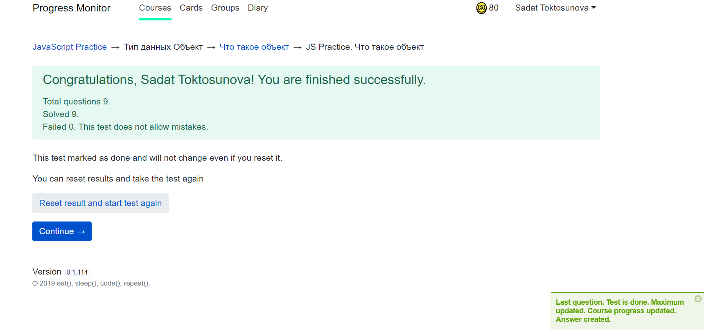
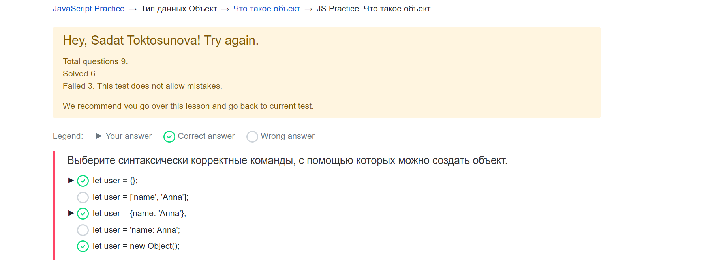

# JavaScript Practice
**Page title:** JAVASCRIPT PRACTICE

**URL:** https://app.pasv.us/course/5d1cbf67086fc30038bf1859

This page is intended to access JavaScript Practice Course.

**Requirements To Access:**
1) Must be a registered users
2) User`s role must be student
3) User must be finished with JavaScript Syntax Course

A purpose of this course is to gain more knowledge about JavaScript. In this course of JavaScript Practice you will
 learn about functions, string methods, array methods, number methods, and objects. 
 
#### Header
 
| No. | Buttons with anchor hyperlink| Result|     
| ------ | ----------- | -------|
| 1 | Progress Monitor |Refreshes the page| 
| 2 | Courses |It takes User to a list of available courses: https://app.pasv.us/course.|
| 3 | Cards |It takes User to the section of Cards: https://app.pasv.us/flash.| 
| 4 | Groups  |It takes User to Groups they belong to: https://app.pasv.us/group.|
| 5 | Diary |It takes User to a list of other Users’ diaries and creation their own diary: https://app.pasv.us/diary.|
| 6 | User’s first and last name |By clicking the button with the User’s first and last name, the User has access to their **Profile, Settings, and Logout**.|

#### Body
This course contains a numbered list with each subject.
##### Symbol and Definitions

| No | Icons | Description 
| ------ | ----------- | -------|
|1| | Symbol will indicate next available lesson
|2|  | Symbol will indicate if section has a video.
|3| | Symbol will indicate if any CodeWars tasks need to be completed before moving to a next section. There might be more than one symbol per section.
|4| | Symbol appear once section has been completed
|5| | Symbol will indicate that section can not begin, due to previous section not being complete
|6| | Symbol will only show up if section has been paused by an Admin
 
 Each subject contains an un-number list of subject sections.
 
 *** Work in progress ****

#### Overview of main page and lesson page

JavaScript Practice course contains 8 sections: 

1. Section 1: Введение
2. Section 2: Основные конструкции JavaScript
3. Section 3: Методы работы с числами
4. Section 4: Массивы
5. Section 5: Тип данных Строка
6. Section 6: Тип данных Объект
7. Section 7: Работа с функциями
8. Section 8: Class   

Each section contains different number of lessons. Every lesson in the section is a 
link, which will redirect the user to the main page of the lesson, where the user 
can read theoretical material, watch video tutorial, find other links related to 
this topic. On the right side of the lesson's name user can find some quantity 
of images of video and Codewars. It will give the user info how many coding 
challenges(katas) the user needs to solve in this lesson and does this lesson has 
video tutorial.  
Before passing lessons every lesson has status ‘closed’.  

Every lesson has header, body, footer.  
Body of the lesson page always contains: 
- link to the JavaScript Course and the name of a section;
- a heading;
- a summary; 
- a quiz.  

Body of the lesson page can contains:
- link to the video tutorial;
- list of coding challenges - links to the Codewars katas.   

The user cannot go to the next lesson without solving given katas and passing 
the quiz.  
The user cannot go to the next section without passing all lessons from previous 
sections.   
After solving a quiz and codding challenges, button “I understood everything…..” 
will appear on the page under the lesson heading. After clicking on this button 
label “Lesson completed successfully. Go to the list of lecture” will appear on the 
lesson page under the heading, where ‘Go to the list of lecture’ is a link to the 
main page of JavaScript Practice course.  
After successfully completed lesson on the left side of the lesson's name 
on the main page of JavaScript Practice course image ____ will appear with tooltip "passed"
And next lesson will have status ‘Opened’.

#### VIDEO 
* Some lessons include short video tutorials on the topic. 
* If a lesson contains a video, the user will see a special “video icon” in the lesson title. 
* Video tutorials are hosted on Viktor Bogutskii’s [Youtube Channel](https://www.youtube.com/channel/UC_qoM-WzRMMG5H177WMbhlw), so they have all Youtube video functionality and Youtube Video Player is used to play the video.
* The user simply needs to press the ‘play’ button to start watching a video.
* Video is responsive and will be simply adjusted to different screen sizes. 
* Users can watch a video in its default window or use the ‘Full Screen’ option from the video player. 
* Users can see a video on the lesson page or watch it directly on Youtube. 

#### Quiz
   
   **Overview**
   
   Each Lesson page typically consists of three sections: one Presentation of the theoretical concepts in the format
   of Notes or a video presentation or both:
   #####             1. Presentation/ Notes/ Video;
    
   and two interactive assignment sections: 
   #####             2. Quiz;
   
   #####             3. Coding Challenges. 
   
   Both Quiz and Coding challenges are interactive sections well-designed to provide a good practice and invite
   the user to go over the concepts discussed in the Presentation in a fun, game-style, entertaining way. 
   
   **Getting Started with Quiz**:
   
   The interactive Quiz section is placed right below the Presentation Section. The user will notice the following red
   notification line: ***To go to the next lesson, you must pass the quiz:***
   
   In order to open the Quiz, the user will have to click on the blue navigation link that carries the title of the 
   current Lesson (preceded by the **JS Practice** pre-title, that is generic for all lessons). This blue navigation link
   is located next to the progress indicator button titled ***Opened*** and highlighted in grey by default. 
   
   Once the quiz is successfully completed, the progress indicator button will turn into green and ***Passed***, 
   and the red notification line will turn into  'Congratulations! You solved all quizzes in this lesson' message 
   in green font.
   
   A click on the blue navigation link that carries the title of the current Lesson will take user to the new Page 
   that will appear essentially as a blank page with only one button,  ***Start quiz*** (in blue highlight mode). 
   Note that this page does have a standard header of the following navigation links:
    [JavaScript Practice](https://app.pasv.us/course/5d1cbf67086fc30038bf1859)→ Title of the Syllabus Section Topic
     → [Title](https://app.pasv.us/course/5d1cbf67086fc30038bf1859/lesson/5d33dc850ca4f0003811126a) of the current Lesson
     → JS Practice.
   
   Once the user clicks on the blue ***Start quiz*** button, the first question will appear on the screen. A typical quiz 
   consists of approximately 5 - 10 questions. Each question is a Multiple Choice question (there are no any Short Answer
   questions  built in the system). A typical number of answer choices ranges from 2 to approximately 8. Normally, 
   the question does not go beyond the scope of the Notes and video presented in the Lesson. Some of the questions in the 
   more advanced topics may show the actual coding examples that require the user to use the 
   [www.jsbin.com](http://www.jsbin.com/) or any other browser or tool to be able to answer the question.  
   

   
   The user will not be allowed to jump ahead to the next questions until she selects at least one answer option and 
   clicks on ***Submit button***. The order of the questions is also pre-set and can not be reshuffled if the user 
   takes this test again. Every subsequent question will be available to view only after the preceding question was 
   submitted by the click of a ***Submit button***. In turn, the Submit button gets activated and turns from blurry blue to 
   the distinct blue only after the user makes a selection of at least one answer choice to the question.  There will be 
   no any immediate notification whether the selected choice was correct or wrong until all of the questions are answered.  
   
   On top of every question there will be a **progress indicator box** (stretched across the entire page from the left 
   to the right) that fills in blue with every question submitted. It serves as an indicator to give the user an idea 
   how far she is gone through the quiz.
   
   Once the last question is turned in, the system will show the results of the test on the screen. If there was any 
   mistake, the system will throw a large green box that will contain four lines: 
   ***Congratulations! Your are finished successfully*** 
   ***Total number of questions -##, out of which Solved -##, Failed -##***
   ***This test does not allow mistakes***
    
   Below the green box there will be some more messages displayed: ***This test marked as done and will not change even 
   if you reset it. You can reset results and take the test again. Reset result and start test again.***
    

   In other words, even if there was no any mistake done, the user will be offered an option to retake the test 
   if she likes to do so. If not, she can click on blue ***Continue*** button and will get redirected to the 
   Syllabus/List of Lessons page.
   
   Please note that every single quiz does not allow for any mistake to proceed further. If the user made a mistake,
   i.e. answered at least one question wrong, then she will have to retake the quiz again. The user will be offered to 
   retake the test as many times as she needs until she finally answers all the questions correct. The system will keep 
   throwing the large pale orange colored notification box on the screen with the following messages: 
   ***Hey! Try again***
  *** Total questions - ##***
   ***Failed - ##. This test does not allow mistakes***
   ***We recommend you go over this lesson and go back to current test***
   

   
   The user will also be able to see all the questions that she did wrong. All of them will appear in the same order 
   and the same format as they were offered during the actual quiz. In particular, the full question statement, 
   along with all answer choices will be displayed again.  Those choices that the user selected will be marked with 
   a black pointer, while correct ones will be circled in green.    The  blue ***Reset result and start test again*** 
   button will also be available for the user to click and start all over again. In other words, once the user clicks on 
   this button, she will be taken to the first question of the same test again. The cycle of retaking the same test ends
    only when the user gets all the questions right and receives the green box of ***Congratulations!...*** messages 
    on her screen with a ***Continue button***
   
    
