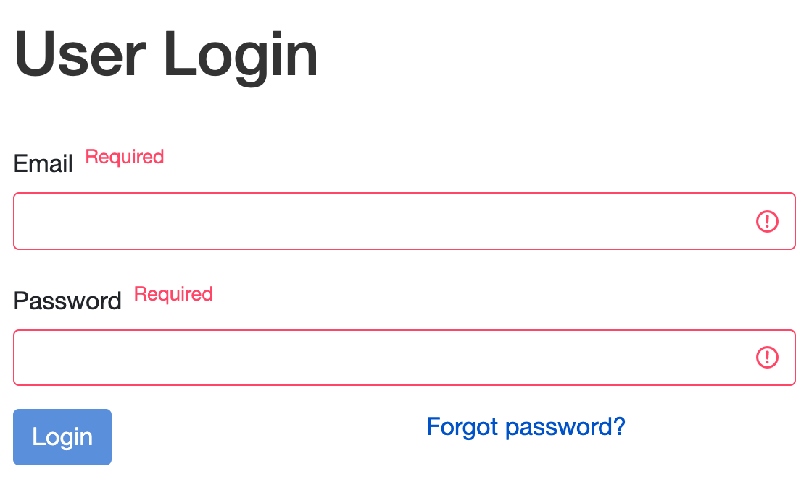

[<<< Back to Table of Contents](index.md)
## USER LOGIN

#### Description

* To be able to login, User must be already registered to the web-page https://app.pasv.us/;
* User Login page https://app.pasv.us/user/login is displayed after User clicks the **Login** button on the homepage.

#### User Interface

#### Header
* Hyperlink __Progress Monitor__ returns to homepage  https://app.pasv.us/
* Buttons: **Login**, **Register**.

#### Body
* User has to fill 2 required text fields: email and password. 
 
* These fields should correspond User’s email and password while their registration:

  * __Email__ - input field, required, accepts only existing on the database User’s email.

  * __Password__ - input field, required, masked by dots.

* __Login__ button - in case of valid credentials, User is redirected to the User’s profile page. In case of invalid credentials, the error message appears.

*  __Forgot Password?__ redirects user to URL https://app.pasv.us/user/password/reset/request. 

[<<< Back to Table of Contents](index.md)